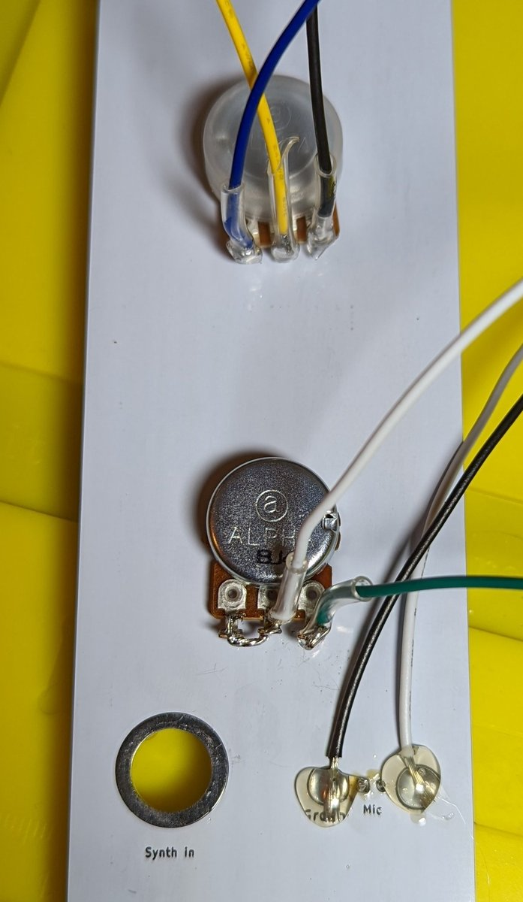
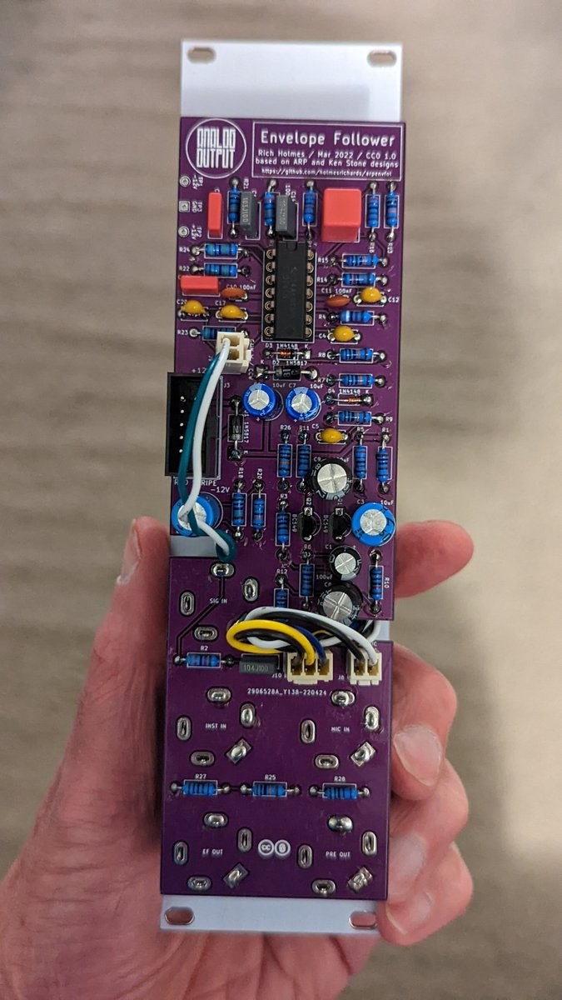

# ARP Envelope follower build notes

## ERRATA

In the first PCB run R23 was 1k and R24 was 3M. I recommend the following resistor value changes, which will increase the maximum gain and output level:

* R23 from 1k to 470R
* R24 from 3M to 4.7M

These values were changed in the design files after the first run.

## Building

There's almost nothing to note about the build; it's very standard aside from one thing. A condenser mic capsule is mounted directly to the front panel. Solder its leads to the through hole pads provided. Then put blobs of solder on the surface pads on the back of the panel and solder stranded wire leads to those pads. I added hot glue on top of these pads to strengthen the mechanical connection. Connect these wires to the mic Molex header on the PCB (or solder directly).

As shown, pins 2 and 3 of the gain pot are connected together, with the other two pins connected to the gain Molex header on the PCB. The other pot has all three pins connected to the PCB. Labels on the PCB indicate pin 1 (counter clockwise, CCW, as seen from the front of the panel), 2 (wiper, W), and 3 (clockwise, CCW). Note wire colors:

## Adjust to taste

Modules that interface to external signals may be the most subjective designs of all. You may want larger or smaller gains. To increase the gain of the preamplifier decrease the value of R23 (or increase the value of the pot). To increase the output signal increase the value of R24 (or decrease the value of R22).
