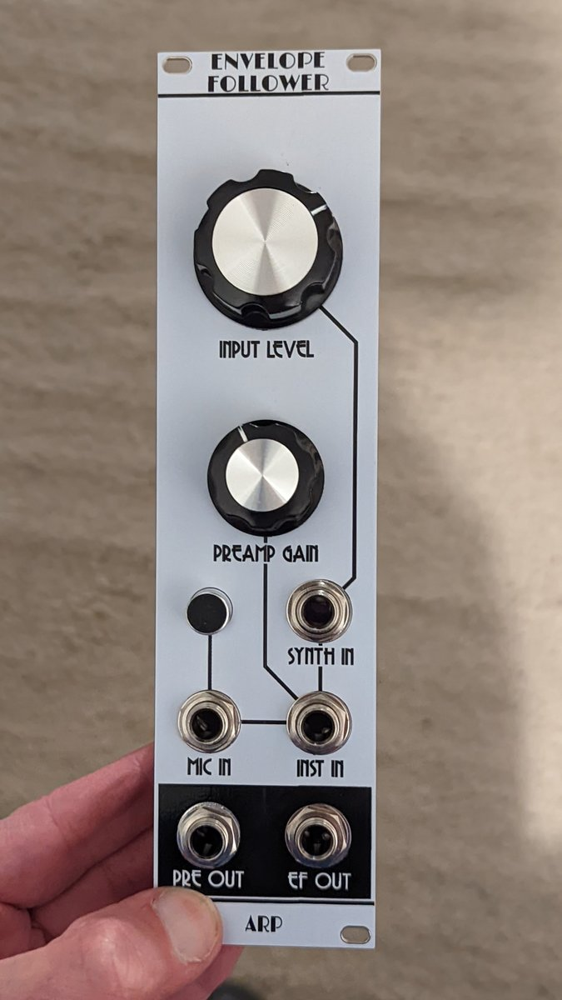

# ARP Envelope follower

This is an envelope follower (EF) module in Kosmo format with mic and instrument preamplifiers.

It is a design based on the ARP 2600 — there’s a schematic in the [service manual](https://usermanual.wiki/Document/Arp2600ServiceManual.2176328765). Aside from changing the op amps to TL074 and reducing the output stage gain (which it seemed to need, maybe because it uses ±12 V instead of the ARP's ±15 V) the EF core is essentially identical to the original.

The ARP EF also has a preamplifier section for input of external, non-synth level signals which, of course, are what you’re going to use an EF on a lot of the time. Rather than try to adapt the Teledyne 1339 based design I replaced the ARP preamp with two different preamps: One to boost instrument levels to synth levels, and one to boost mic levels to instrument levels — which then goes through the other preamp as well. This is inspired by Eddie Bergman's [stripboard build](https://www.eddybergman.com/2020/02/synthesizer-build-part-20-arp2600.html), though I used different preamp circuits. The mic preamp is from a [design](http://www.zen22142.zen.co.uk/Circuits/Audio/ecmmic.htm) by Andy Collinson (with a mod from [here](https://electronics.stackexchange.com/questions/324047/%20what-is-the-best-preamplifier-circuit-for-electret-condenser-microphone)) while the instrument preamp is based on the one in Ken Stone’s [Stomp Box Adapter](https://sdiy.info/wiki/CGS_stomp_box_adapter_(smaller_version)).

If nothing’s plugged into the synth input it uses the output of the instrument preamp, and if nothing’s plugged into the input of the instrument preamp it uses the output of the mic preamp. And if nothing’s plugged into the input of the mic preamp it uses the condenser mic capsule mounted on the front panel! Yes, this module is always listening, so be careful what you say. Besides going to the EF input, the instrument preamp output goes to a front panel jack, so you can use this module to feed external signals (or the front panel mic) to other modules too.

This module isn't really a plug and play kind of thing. The output levels you get depend not only on the amplitude of the input signal but the waveform — square waves give bigger outputs than ramp waves, for instance. With an external signal source you will want to use the gain knob to get the preamp output up to around 10 Vpp, and then use the signal level knob to get the output to the right level. It's probably a good idea to use a scope to check your settings.

## Current draw
? mA +12 V, ? mA -12 V


## Photos




## Documentation

* [Schematic](Docs/arpenvfol.pdf)
* PCB layout: [front](Docs/_layout_front.pdf), [back](Docs/_layout_back.pdf)
* [BOM](Docs/arpenvfol_bom.md)
* [Build notes](Docs/build.md)

## GitHub repository

* [https://github.com/holmesrichards/arpenvfol](https://github.com/holmesrichards/arpenvfol)

## Submodules

This repo uses submodules aoKicad and Kosmo_panel, which provide needed libaries for KiCad. To clone:

```
git clone git@github.com:holmesrichards/arpenvfol.git
git submodule init
git submodule update
```


Alternatively do

```
git clone --recurse-submodules git@github.com:holmesrichards/arpenvfol.git
```

Or if you download the repository as a zip file, you must also click on the "aoKicad" and "Kosmo\_panel" links on the GitHub page (they'll have "@ something" after them) and download them as separate zip files which you can unzip into this repo's aoKicad and Kosmo\_panel directories.

If desired, copy the files from aoKicad and Kosmo\_panel to wherever you prefer (your KiCad user library directory, for instance, if you have one). Then in KiCad, go into Edit Symbols and add symbol libraries 

```
aoKicad/ao_symbols
Kosmo_panel/Kosmo
```
and go into Edit Footprints and add footprint libraries 
```
aoKicad/ao_tht
Kosmo_panel/Kosmo_panel.
```
